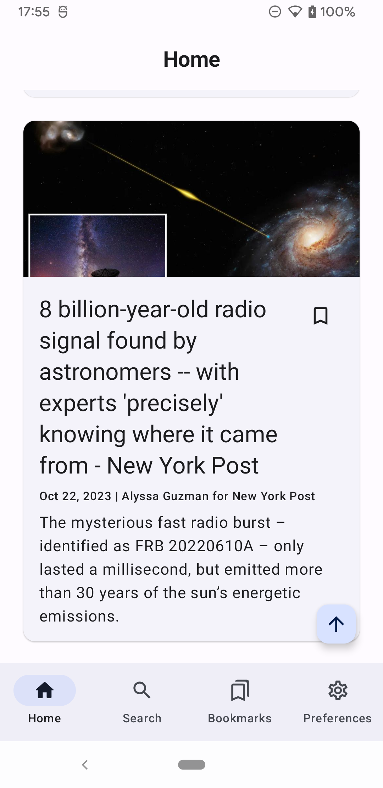

    

    

    
    

**NEWS** is an offline-first free mobile application that provides users with access to top headlines from trusted news sources.

## Screenshots

    
    
    

## Features

- **Top Headlines**: Access the latest news from reliable sources.
- **Bookmark Stories**: Save articles to read later.
- **Search and Filters**: Find news articles with powerful search and filtering options.
- **Country Preference**: Customize your news based on your location or preferences.
- **Dark Mode**: Read comfortably in dark mode.

## Technologies Used

- **Jetpack Compose**: A modern Android UI toolkit for building native user interfaces.
- **Retrofit**: A HTTP client for making network requests in Android apps.
- **Room**: An Android SQLite database library that simplifies data persistence.
- **WorkManager**: Used for background processing tasks such as syncing Room database.
- **DataStore**: A data storage solution for persisting key-value pairs such as user preferences.
- **Material Design 3**: A design language for creating visually appealing and consistent user interfaces.
- **NewsAPI.org**: An API used to fetch news data from various sources.
